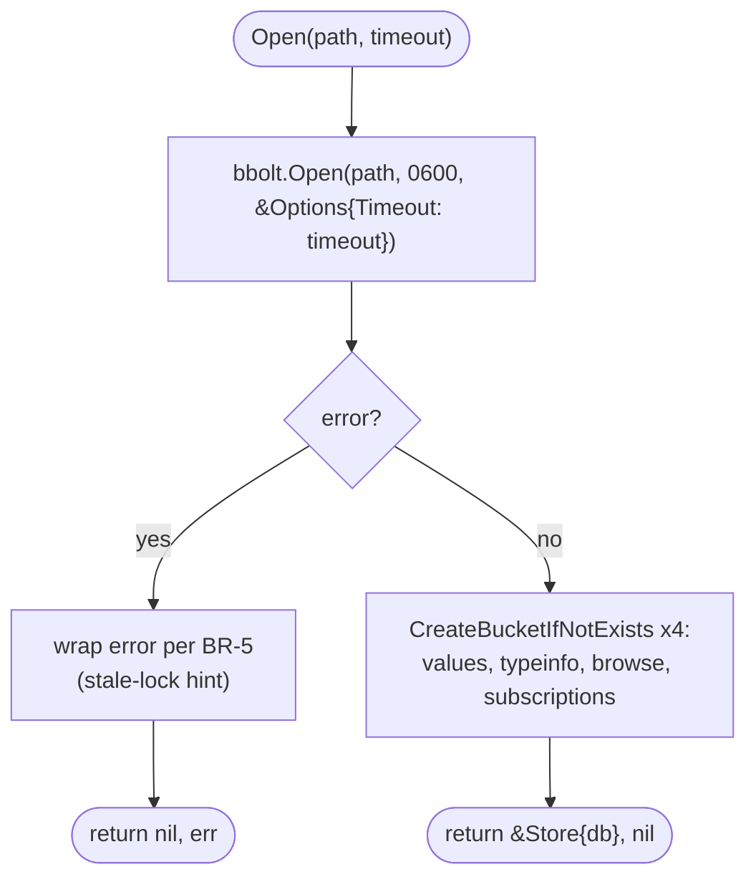

# Business Logic Model - Unit 1: Persistent Store

## Core workflow: `Open`



### Text alternative
```
Open(path, timeout):
  db, err := bbolt.Open(path, 0600, &bbolt.Options{Timeout: timeout})
  if err != nil: return nil, wrapped-error-with-stale-lock-hint (BR-5)
  db.Update(create all 4 buckets via CreateBucketIfNotExists)  (BR-6)
  return &Store{db: db}, nil
```

## Core workflow: `PutValue` / `GetValue` (the only bucket needing BR-2's type-fidelity encoding)

```mermaid
flowchart TD
    PutStart(["PutValue(nodeID, entry)"])
    PutValidate{"nodeID empty?"}
    PutValidateErr(["return error (BR-3)"])
    PutEncode["encode(entry.Value) -> encodedValue<br/>(type switch over closed set, BR-2)"]
    PutEncodeErr{"unknown type?"}
    PutEncodeErrReturn(["return error - fail fast, no silent fallback"])
    PutMarshal["json.Marshal(entry with encodedValue)"]
    PutBboltWrite["db.Update: values bucket Put(nodeID, bytes)"]
    PutOK(["return nil"])

    PutStart --> PutValidate
    PutValidate -->|yes| PutValidateErr
    PutValidate -->|no| PutEncode --> PutEncodeErr
    PutEncodeErr -->|yes| PutEncodeErrReturn
    PutEncodeErr -->|no| PutMarshal --> PutBboltWrite --> PutOK

    GetStart(["GetValue(nodeID)"])
    GetValidate{"nodeID empty?"}
    GetValidateErr(["return error (BR-3)"])
    GetBboltRead["db.View: values bucket Get(nodeID)"]
    GetMiss{"key missing?"}
    GetMissReturn(["return zero, false, nil"])
    GetUnmarshal["json.Unmarshal into entry-with-encodedValue"]
    GetDecode["decode(encodedValue) -> interface{}<br/>(reverse of encode)"]
    GetOK(["return entry, true, nil"])

    GetStart --> GetValidate
    GetValidate -->|yes| GetValidateErr
    GetValidate -->|no| GetBboltRead --> GetMiss
    GetMiss -->|yes| GetMissReturn
    GetMiss -->|no| GetUnmarshal --> GetDecode --> GetOK
```



### Text alternative
```
PutValue(nodeID, entry):
  if nodeID == "": return error (BR-3)
  encoded, err := encode(entry.Value)   # type switch, BR-2
  if err != nil: return err             # fail fast, no fallback
  bytes := json.Marshal({...entry fields..., Value: encoded})
  db.Update(values.Put(nodeID, bytes))
  return nil

GetValue(nodeID):
  if nodeID == "": return zero, false, error (BR-3)
  bytes := db.View(values.Get(nodeID))
  if bytes == nil: return zero, false, nil    # cache miss, not an error
  unmarshal bytes into {..., Value: encodedValue}
  value := decode(encodedValue)                # reverse of encode
  return entry-with-value, true, nil
```

## `encode`/`decode` (the BR-2 type-fidelity mechanism)

```
encode(v interface{}) (encodedValue, error):
  switch x := v.(type):
    case bool:            return {Kind: "bool", Raw: marshal(x)}, nil
    case int8...int64:     return {Kind: "intN", Raw: marshal(x)}, nil
    case uint8...uint64:    return {Kind: "uintN", Raw: marshal(x)}, nil
    case float32, float64: return {Kind: "floatN", Raw: marshal(x)}, nil
    case string:           return {Kind: "string", Raw: marshal(x)}, nil
    case time.Time:        return {Kind: "time", Raw: marshal(x)}, nil
    case []byte:           return {Kind: "bytes", Raw: marshal(x)}, nil  # encoding/json already base64s this
    case []interface{}:
      elems := [encode(e) for e in x]  # recursive
      return {Kind: "array", Elems: elems}, nil
    default:
      return {}, fmt.Errorf("store: cannot encode value of type %T", v)  # BR-2 fail-fast

decode(e encodedValue) (interface{}, error):
  switch e.Kind:
    case "bool": var v bool; unmarshal(e.Raw, &v); return v, nil
    ... (mirror of encode, one case per Kind) ...
    case "array":
      out := make([]interface{}, len(e.Elems))
      for i, elem := range e.Elems: out[i] = decode(elem)  # recursive
      return out, nil
    default:
      return nil, fmt.Errorf("store: unknown encoded kind %q", e.Kind)
```

## Other buckets (`typeinfo`, `browse`, `subscriptions`)
Same shape as `PutValue`/`GetValue` minus the encode/decode step (BR-2 only
applies to `ValueEntry.Value` - every other struct's fields are already
concrete, JSON-safe types): validate key non-empty (BR-3) → `json.Marshal`/
`Unmarshal` directly → `db.Update`/`View`. `ListSubscriptions` additionally
iterates the whole `subscriptions` bucket via `Bucket.ForEach`, unmarshaling
each entry.

## No cross-bucket transactions in this unit
Every method operates on exactly one bucket, one key, one bbolt transaction.
Nothing in Unit 1's scope requires multiple buckets to change atomically
together (that concern, if it ever arises, belongs to whichever Unit 2/3
business logic would need it - see `business-rules.md` BR-4's note).
