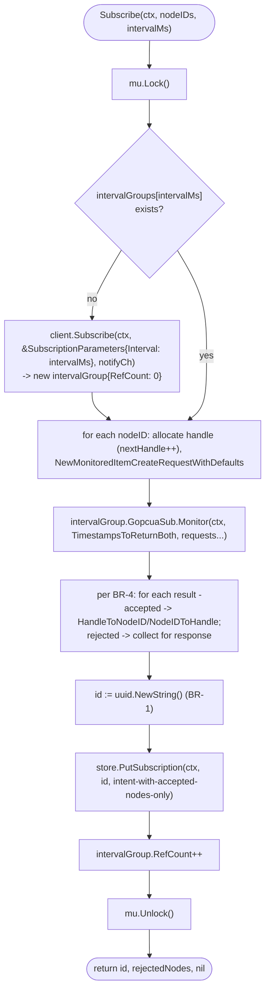
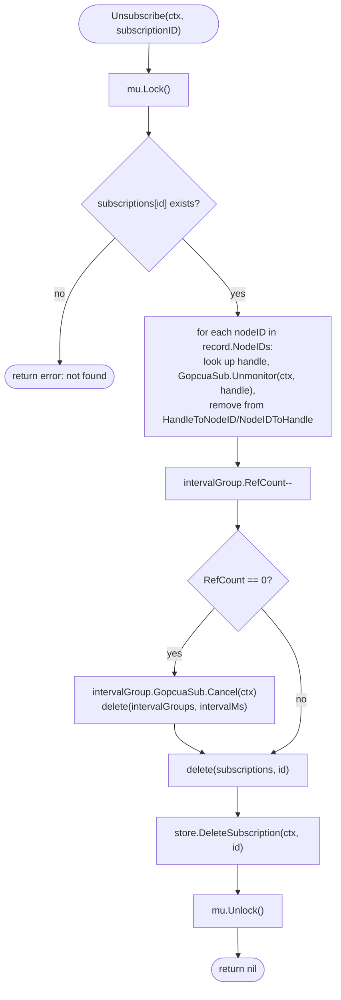
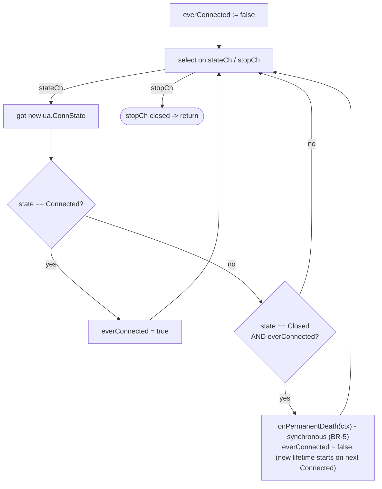

# Business Logic Model - Unit 2: Subscription Management

## Core workflow: `Subscribe`



## Core workflow: `Unsubscribe`



## Notification pump (one goroutine, started in `Start`, joined in `Stop`)

```mermaid
flowchart TD
    Loop["select on notifyCh / stopCh"]
    GotNotif["got *ua.PublishNotificationData"]
    Lookup["mu.RLock(): resolve which node(s) changed<br/>via the notification's monitored-item handles -><br/>HandleToNodeID (searched across all intervalGroups)"]
    Batch["accumulate into a batch, up to<br/>BatchMaxItems or until BatchWindow elapses"]
    Flush["for each batched (nodeID, value):<br/>store.PutValue(ctx, nodeID, ValueEntry{..., Source: \"subscription\"})"]
    OnErr["error? -> log via internal/logger, continue (BR-6)"]
    GotStop(["stopCh closed -> flush remaining batch, return"])

    Loop -->|notifyCh| GotNotif --> Lookup --> Batch
    Batch -->|window/size threshold reached| Flush --> OnErr --> Loop
    Batch -->|not yet| Loop
    Loop -->|stopCh| GotStop
```

### Text alternative (pump)
```
for {
  select {
  case notif := <-notifyCh:
    resolve notif's handles -> node IDs (mu.RLock during lookup)
    add (nodeID, value, timestamp) to pending batch
    if len(batch) >= BatchMaxItems: flush()
  case <-batchWindowTicker.C:
    if len(batch) > 0: flush()
  case <-stopCh:
    flush()  // drain whatever's pending before returning
    return
  }
}

flush():
  for each (nodeID, entry) in batch:
    if err := cache.PutValue(ctx, nodeID, entry); err != nil {
      logger.Warn("failed to cache subscription value", "node_id", nodeID, "error", err)  // BR-6: log and continue
    }
  clear batch
```

## `ReconnectWatcher`'s watch loop



### Text alternative
```
everConnected := false
for {
  select {
  case state := <-stateCh:
    if state == Connected: everConnected = true
    else if state == Closed && everConnected:
      onPermanentDeath(ctx)   // synchronous, BR-5
      everConnected = false   // reset for the new Client's lifetime after rebuild
  case <-stopCh:
    return
  }
}
```

## `SubscriptionManager.Start` (warm-start, BR-7)

```
Start(ctx):
  intents := store.ListSubscriptions(ctx)
  for each intent:
    # re-run the Subscribe logic against intent.NodeIDs/IntervalMs,
    # reusing intent.ID rather than generating a new uuid (this is a
    # restore, not a new logical subscription)
    rebuild intervalGroups/subscriptions in memory from intent
  watcher.Start(ctx)  # begin watching for future permanent death
  start pump goroutine
  return nil  # only after all of the above complete (BR-7)
```

`onPermanentDeath`'s rebuild callback (registered with `watcher` during
`Start`) performs the same "re-run Subscribe logic per persisted intent"
step against a freshly-`Connect`ed `Client` - it's the same warm-start
logic, invoked again after a permanent death rather than only at process
startup.
