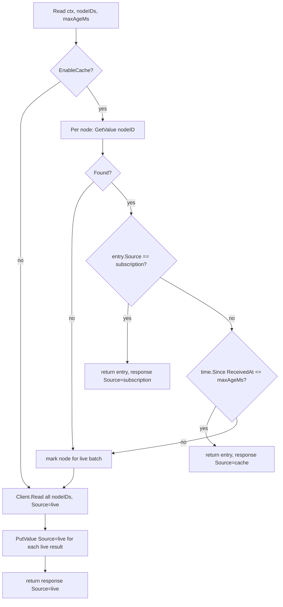
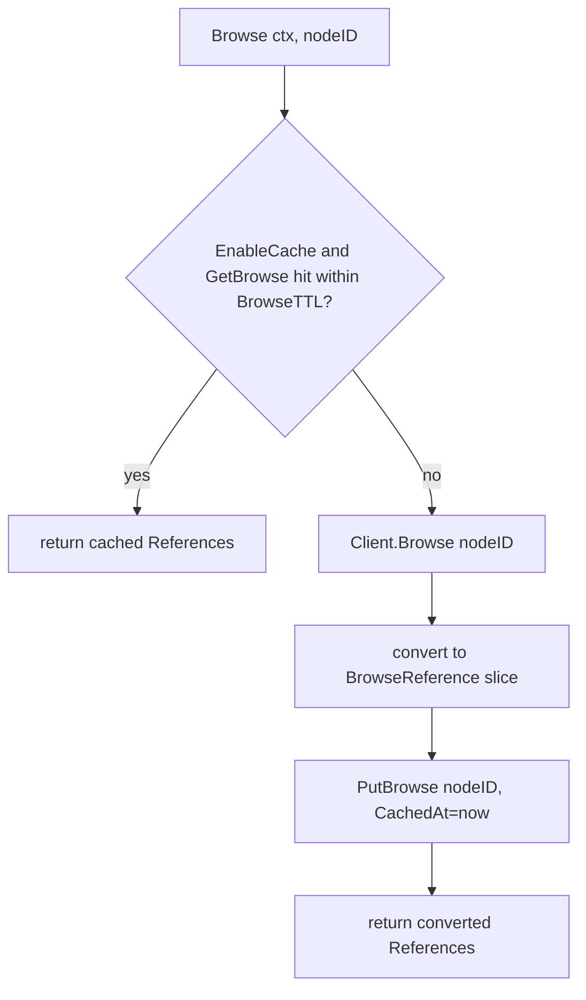
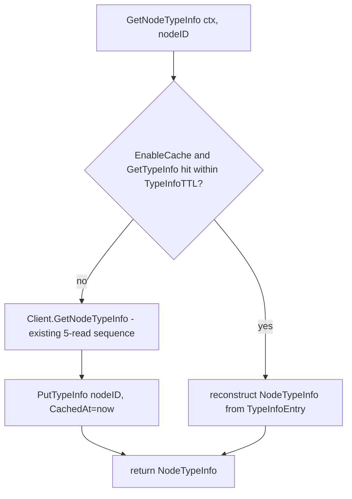
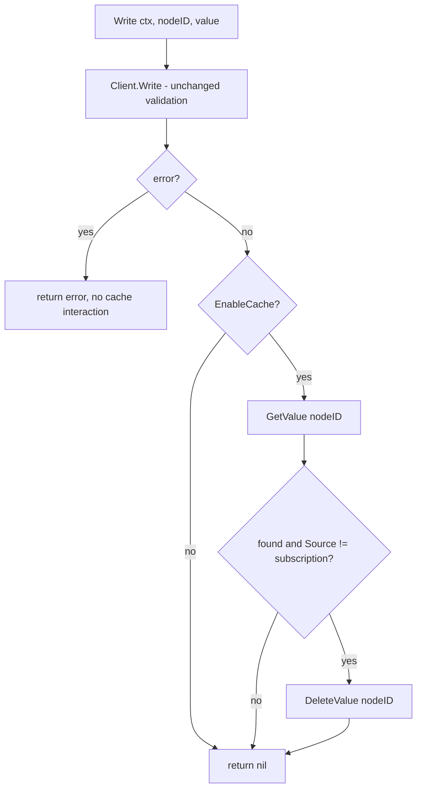
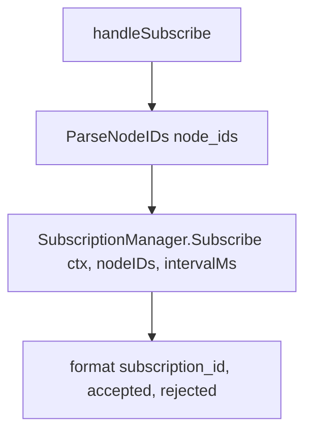
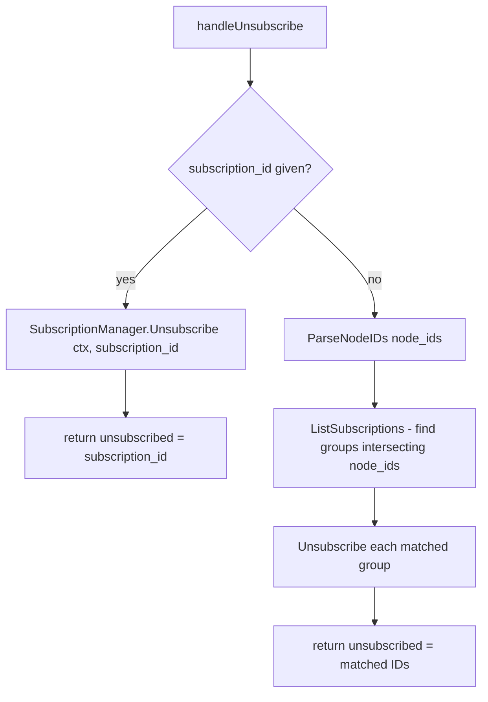
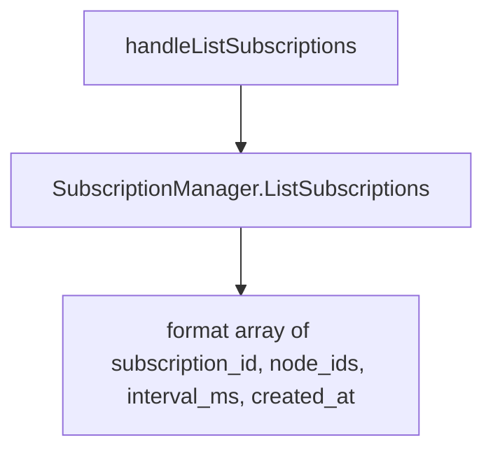
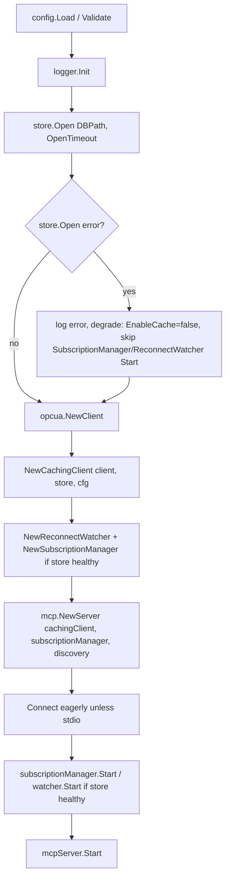
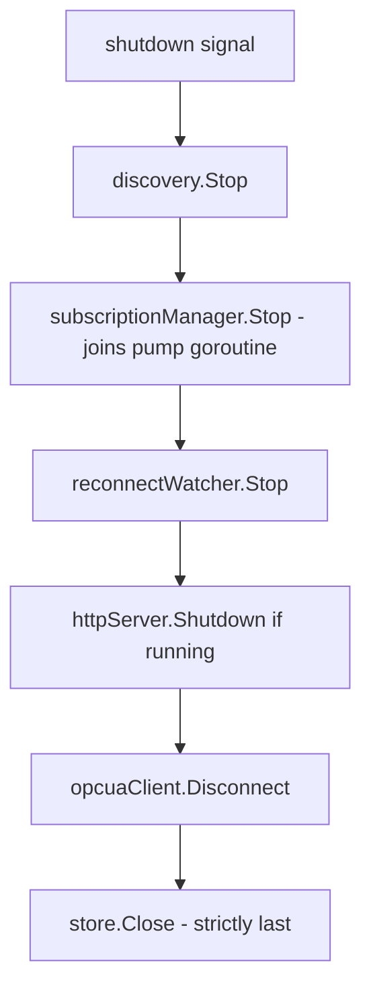

# Business Logic Model - Unit 3: Read-Through Caching & MCP Integration

## `CachingClient.Read` (BR-1, BR-2)

## `CachingClient.Browse` (BR-3)

## `CachingClient.GetNodeTypeInfo` (BR-4)

## `CachingClient.Write` (BR-5)

## `opcua_subscribe` tool handler (BR-7)

## `opcua_unsubscribe` tool handler (BR-7, BR-8)

## `opcua_list_subscriptions` tool handler (BR-7)

## Startup/shutdown ordering (BR-10, BR-11)

