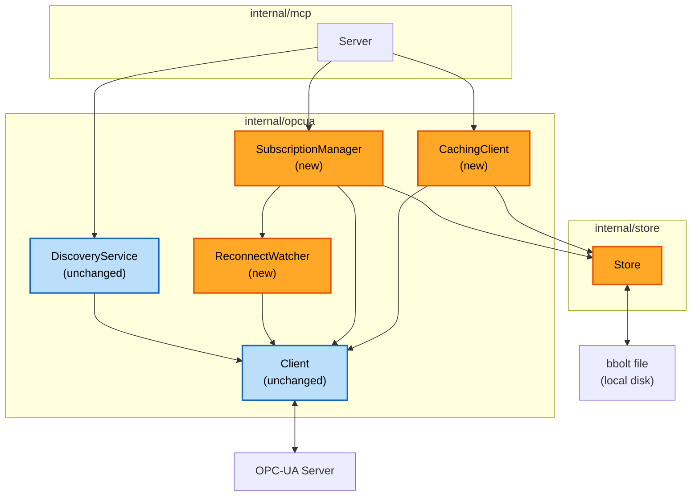

# Component Dependencies - Phase 2

## Dependency Matrix

| Component | Depends On | Dependency Type |
|---|---|---|
| `store.Store` | `go.etcd.io/bbolt` | Direct (promoted from indirect) |
| `opcua.CachingClient` | `opcua.Client`, `valueTypeBrowseStore` (implemented by `store.Store`) | Compile |
| `opcua.SubscriptionManager` | `opcua.Client`, `subscriptionStore` (implemented by `store.Store`), `opcua.ReconnectWatcher` | Compile |
| `opcua.ReconnectWatcher` | `opcua.Client` (for `StateChangedCh`/`StateChangedFunc`) | Compile |
| `mcp.Server` | `opcua.CachingClient` (replaces direct `opcua.Client` use for read/browse/typeinfo paths), `opcua.SubscriptionManager`, `opcua.DiscoveryService` (unchanged), `internal/config`, `internal/logger` | Compile |
| `cmd/opcua-mcp` | all of the above, for construction/wiring | Compile |

No new dependency on `internal/config`/`internal/logger` beyond what
already exists - both remain leaf packages.

## Communication Patterns

- **`mcp.Server` → `CachingClient`/`SubscriptionManager`**: direct method
  calls, same pattern as today's `mcp.Server` → `opcua.Client` calls - no
  new communication mechanism (no internal message bus, no channels
  crossing this boundary).
- **`SubscriptionManager` internal (pump goroutine)**: gopcua's
  `notifyCh chan *ua.PublishNotificationData` → batching goroutine → `store`
  writes. One goroutine, started in `Start`, joined in `Stop`.
- **`ReconnectWatcher` internal**: `opcua.StateChangedCh` (a
  `chan<- ua.ConnState` gopcua writes into) → watcher goroutine → calls
  `onPermanentDeath` callback synchronously in that goroutine (the callback
  itself, `SubscriptionManager`'s rebuild logic, is expected to be quick to
  invoke though its work may take time - Functional Design decides whether
  the callback itself spawns further async work).
- **`CachingClient` ↔ `SubscriptionManager` (provenance)**: no direct
  dependency between these two components (see `services.md`'s
  recommendation to carry provenance in `store.ValueEntry` itself instead)
  - avoids a dependency cycle risk between the two new components.

## Data Flow Diagram



### Text alternative
```
Server (mcp) -> CachingClient (new) -> Client (unchanged) -> OPC-UA Server
Server (mcp) -> CachingClient (new) -> Store (new) -> bbolt file
Server (mcp) -> SubscriptionManager (new) -> Client (unchanged) -> OPC-UA Server
Server (mcp) -> SubscriptionManager (new) -> Store (new) -> bbolt file
Server (mcp) -> SubscriptionManager (new) -> ReconnectWatcher (new) -> Client
Server (mcp) -> DiscoveryService (unchanged) -> Client (unchanged)
```

No cyclic dependencies introduced. `Client` remains the single point of
contact with the live OPC-UA server; `Store` remains the single point of
contact with the local bbolt file.
