# Execution Plan — Phase 2: Subscriptions + Persistent Cache

## Detailed Analysis Summary

### Transformation Scope (Brownfield)
- **Transformation Type**: Application-layer feature addition — no infrastructure/deployment-model transformation (still a single Go binary/container, no Lambda/ECS/cloud-resource changes).
- **Primary Changes**: New `internal/store` package (bbolt persistence); new `internal/opcua/subscription.go` (`SubscriptionManager`); read-through caching added to existing read/browse/type-info paths; 3 new MCP tools; config additions/cleanup.
- **Related Components**: `internal/opcua/client.go`, `internal/opcua/discovery.go`, `internal/mcp/server.go`, `internal/config/config.go`, `cmd/opcua-mcp.go`, `Dockerfile`, `README.md`, `Makefile` (new integration-test target), plus new test-only dependency `testcontainers-go`.

### Change Impact Assessment
- **User-facing changes**: Yes — 3 new MCP tools (`opcua_subscribe`/`opcua_unsubscribe`/`opcua_list_subscriptions`); `opcua_read` gains `max_age_ms`/`source`/`cached_at`.
- **Structural changes**: Yes — new package (`internal/store`), new file (`internal/opcua/subscription.go`), `Client`/`DiscoveryService` gain cache-aware read paths.
- **Data model changes**: Yes — 5 new bbolt bucket schemas (`values`, `typeinfo`, `browse`, `nodes`, `subscriptions`).
- **API changes**: Yes — additive MCP tool surface; `opcua_read`'s response shape may change (explicitly not backward-compat-constrained, per requirements.md FR-3.3/Q9).
- **NFR impact**: Yes — reliability (reconnect handling via gopcua v0.9.0's verified internal behavior), performance (redundant round-trip reduction via caching), security (new dependency pinning: bbolt v1.5.x, testcontainers-go), testability (new PBT + integration-test infrastructure).

### Component Relationships

```
- Primary Components: internal/store (new), internal/opcua/subscription.go (new)
- Modified Components: internal/opcua/client.go (minor - connection/state exposure for
  SubscriptionManager), internal/opcua/discovery.go (browse-result caching integration),
  internal/mcp/server.go (3 new tools, opcua_read changes), internal/config/config.go
  (new StoreConfig, EnableCache repurposed, CacheTTL/MaxCacheSize removed)
- Dependent Components: cmd/opcua-mcp.go (store lifecycle: open at startup, close last at shutdown)
- Supporting Components: README.md, Dockerfile, Makefile (new integration-test target),
  new testcontainers-go-based integration test suite
```

| Component | Change Type | Change Reason | Priority |
|---|---|---|---|
| `internal/store` | Major (new) | Foundational persistence layer | Critical |
| `internal/opcua/subscription.go` | Major (new) | Core Phase 2 capability | Critical |
| `internal/opcua/client.go` | Minor | Expose what `SubscriptionManager` needs (state/reconnect hook) | Important |
| `internal/opcua/discovery.go` | Minor | Browse-result read-through caching | Important |
| `internal/config/config.go` | Minor | New `StoreConfig`; repurpose/remove `Search*` cache fields | Important |
| `internal/mcp/server.go` | Major | 3 new tools + `opcua_read` read-through integration | Critical |
| `cmd/opcua-mcp.go` | Minor | Wire store open/close into startup/shutdown | Important |
| `Dockerfile`/`README.md`/`Makefile` | Minor | Document new DB path; new integration-test target | Optional (can trail the code) |

### Risk Assessment
- **Risk Level**: Medium. New concurrency and persistence surface, but scoped to `internal/opcua`/`internal/store`/`internal/mcp` only (no infra/deployment-model change), builds on a now-verified-safe gopcua v0.9.0 reconnect model, and reuses this project's established `opcuaClient` mock-seam testing pattern.
- **Rollback Complexity**: Easy-to-Moderate — additive feature; existing behavior is preserved exactly when `SEARCH_ENABLE_CACHE=false` and no subscriptions are created; a straightforward `git revert` if needed since Phase 2 doesn't modify Phase 0/1 code paths' core logic, only adds cache-aware branches around them.
- **Testing Complexity**: Complex — new integration-test infrastructure (testcontainers-go + Microsoft OPC-UA test server image) alongside the existing mocked-unit-test style, plus new PBT infrastructure (framework TBD, NFR-3.4).

## Workflow Visualization

```mermaid
flowchart TD
    Start(["User Request: Phase 2"])

    subgraph INCEPTION["🔵 INCEPTION PHASE"]
        WD["Workspace Detection<br/><b>COMPLETED</b>"]
        RE["Reverse Engineering<br/><b>COMPLETED</b>"]
        RA["Requirements Analysis<br/><b>COMPLETED</b>"]
        US["User Stories<br/><b>SKIPPED</b>"]
        WP["Workflow Planning<br/><b>IN PROGRESS</b>"]
        AD["Application Design<br/><b>EXECUTE</b>"]
        UG["Units Generation<br/><b>EXECUTE</b>"]
    end

    subgraph CONSTRUCTION["🟢 CONSTRUCTION PHASE (per unit)"]
        FD["Functional Design<br/><b>EXECUTE</b>"]
        NFRA["NFR Requirements<br/><b>EXECUTE</b>"]
        NFRD["NFR Design<br/><b>EXECUTE</b>"]
        ID["Infrastructure Design<br/><b>SKIP</b>"]
        CG["Code Generation<br/><b>EXECUTE</b>"]
        BT["Build and Test<br/><b>EXECUTE</b>"]
    end

    subgraph OPERATIONS["🟡 OPERATIONS PHASE"]
        OPS["Operations<br/><b>PLACEHOLDER</b>"]
    end

    Start --> WD
    WD --> RE
    RE --> RA
    RA -.-> US
    US --> WP
    RA --> WP
    WP --> AD
    AD --> UG
    UG --> FD
    FD --> NFRA
    NFRA --> NFRD
    NFRD -.-> ID
    NFRD --> CG
    ID --> CG
    CG -.->|Next Unit| FD
    CG --> BT
    BT -.-> OPS
    BT --> End(["Complete"])

    style WD fill:#4CAF50,stroke:#1B5E20,stroke-width:3px,color:#fff
    style RE fill:#4CAF50,stroke:#1B5E20,stroke-width:3px,color:#fff
    style RA fill:#4CAF50,stroke:#1B5E20,stroke-width:3px,color:#fff
    style WP fill:#FFA726,stroke:#E65100,stroke-width:3px,color:#000
    style AD fill:#FFA726,stroke:#E65100,stroke-width:3px,stroke-dasharray: 5 5,color:#000
    style UG fill:#FFA726,stroke:#E65100,stroke-width:3px,stroke-dasharray: 5 5,color:#000
    style FD fill:#FFA726,stroke:#E65100,stroke-width:3px,stroke-dasharray: 5 5,color:#000
    style NFRA fill:#FFA726,stroke:#E65100,stroke-width:3px,stroke-dasharray: 5 5,color:#000
    style NFRD fill:#FFA726,stroke:#E65100,stroke-width:3px,stroke-dasharray: 5 5,color:#000
    style ID fill:#BDBDBD,stroke:#424242,stroke-width:2px,stroke-dasharray: 5 5,color:#000
    style CG fill:#4CAF50,stroke:#1B5E20,stroke-width:3px,color:#fff
    style BT fill:#4CAF50,stroke:#1B5E20,stroke-width:3px,color:#fff
    style US fill:#BDBDBD,stroke:#424242,stroke-width:2px,stroke-dasharray: 5 5,color:#000
    style OPS fill:#FFF59D,stroke:#F57F17,stroke-width:2px,stroke-dasharray: 5 5,color:#000
    style Start fill:#CE93D8,stroke:#6A1B9A,stroke-width:3px,color:#000
    style End fill:#CE93D8,stroke:#6A1B9A,stroke-width:3px,color:#000
    style INCEPTION fill:#BBDEFB,stroke:#1565C0,stroke-width:3px,color:#000
    style CONSTRUCTION fill:#C8E6C9,stroke:#2E7D32,stroke-width:3px,color:#000
    style OPERATIONS fill:#FFF59D,stroke:#F57F17,stroke-width:3px,color:#000

    linkStyle default stroke:#333,stroke-width:2px
```



### Text alternative
```
INCEPTION: Workspace Detection (done) -> Reverse Engineering (done) ->
  Requirements Analysis (done) -> User Stories (skipped) ->
  Workflow Planning (this doc) -> Application Design (execute) ->
  Units Generation (execute)
CONSTRUCTION (per unit, repeats for each of the ~3 units):
  Functional Design (execute) -> NFR Requirements (execute) ->
  NFR Design (execute) -> Infrastructure Design (skip) ->
  Code Generation (execute) -> [next unit loops back to Functional Design]
  -> Build and Test (execute, once after all units)
OPERATIONS: placeholder
```

## Phases to Execute

### 🔵 INCEPTION PHASE
- [x] Workspace Detection (COMPLETED)
- [x] Reverse Engineering (COMPLETED)
- [x] Requirements Analysis (COMPLETED)
- [x] User Stories (SKIPPED — single user type/LLM client, well-defined tool contracts, no divergent user journeys; user accepted this recommendation)
- [x] Workflow Planning (IN PROGRESS — this document)
- [ ] Application Design - **EXECUTE**
  - **Rationale**: Two genuinely new components (`SubscriptionManager`, `store.Store`) need their method signatures, responsibilities, and dependencies defined before units can be meaningfully scoped — this isn't a change within existing component boundaries.
- [ ] Units Generation - **EXECUTE**
  - **Rationale**: New data models/schemas (5 bbolt buckets), new API surface (3 tools), complex state management (subscription lifecycle + reconnect), and changes spanning 6 files/packages — squarely meets the Units Generation trigger criteria.

### 🟢 CONSTRUCTION PHASE (evaluated per-unit; initial expectation below, refined when each unit's design starts)
- [ ] Functional Design - **EXECUTE**
  - **Rationale**: Real business logic needing detailed design in at least two units — the store's typed bucket schema/TTL semantics, and the subscription manager's reconnect/persistence state machine.
- [ ] NFR Requirements - **EXECUTE**
  - **Rationale**: A genuine tech-stack selection is still open (PBT framework, requirements.md NFR-3.4), plus the security/resiliency NFRs from requirements.md need incorporating into each unit's design.
- [ ] NFR Design - **EXECUTE**
  - **Rationale**: Follows from NFR Requirements executing — the selected PBT framework and the applicable resiliency/security patterns (timeouts, graceful degradation, dependency pinning) need to land in the actual per-unit designs.
- [ ] Infrastructure Design - **SKIP**
  - **Rationale**: No infrastructure-as-code, cloud resources, or deployment-model change in this project — it remains a single Go binary/container. The Docker/README documentation update (requirements.md NFR-5.1) is handled as a normal deliverable of the relevant unit's Code Generation, not a distinct infrastructure-design stage.
- [ ] Code Generation - EXECUTE (ALWAYS)
  - **Rationale**: Implementation planning and code generation needed for every unit.
- [ ] Build and Test - EXECUTE (ALWAYS)
  - **Rationale**: Full `go build/vet/gofmt/test -race` verification plus the new integration-test suite, once all units are complete.

### 🟡 OPERATIONS PHASE
- [ ] Operations - PLACEHOLDER
  - **Rationale**: Future deployment and monitoring workflows; out of scope for this pass per requirements.md's resiliency-extension answers (experimental/lab tool, no formal ops process).

## Package Update Sequence

Single Go module (not a multi-package monorepo), so this is a dependency-ordered build sequence within the module, not a cross-repo coordination plan:

1. **`internal/store`** (new) — foundational, depends on nothing else new. Must land first since everything else in Phase 2 depends on it.
2. **`internal/config`** — `StoreConfig` addition + `SearchConfig` cleanup. Can land alongside `internal/store` (low coupling) or immediately after.
3. **`internal/opcua/subscription.go`** (new) — depends on `internal/store` (persisted intent) and the existing `internal/opcua/client.go` (gopcua's `Subscribe`/`Monitor`/`StateChangedCh`).
4. **`internal/opcua/client.go` + `internal/opcua/discovery.go`** (modified) — read-through caching for values/typeinfo/browse, depends on `internal/store`.
5. **`internal/mcp/server.go`** (modified) — 3 new tools + `opcua_read` integration, depends on `internal/opcua/subscription.go` and the caching changes in step 4.
6. **`cmd/opcua-mcp.go`** (modified) — wires `store.Open`/`Close` into startup/shutdown, depends on everything above existing.
7. **Integration tests + `Dockerfile`/`README.md`/`Makefile` updates** — depend on the feature being functionally complete; can start test-infrastructure setup (testcontainers plumbing) in parallel with step 1, but the actual test scenarios need steps 1-6 done.

This sequence maps closely to (but doesn't rigidly fix) the ~3 units Units Generation is expected to produce: store, subscription manager, and MCP/read-through integration.

## Estimated Timeline
- **Total Phases**: 2 remaining INCEPTION stages (Application Design, Units Generation) + ~3 CONSTRUCTION units × (Functional Design, NFR Requirements, NFR Design, Code Generation) + 1 Build and Test pass.
- **Estimated Duration**: Not time-boxed in this workflow (AI-paced, not calendar-paced) — sized as "the largest unit of work this session has taken on," comparable in scope to the entire Phase 0+Phase 1 hardening pass combined (16 commits, 123 tests), given the new persistence layer and integration-test infrastructure.

## Success Criteria
- **Primary Goal**: Push-based OPC-UA subscriptions (persisted across restarts, reconnect-resilient) and a persistent read-through cache, without regressing any existing Phase 0/1 behavior.
- **Key Deliverables**: `internal/store` package; `SubscriptionManager`; read-through caching on read/browse/type-info paths; 3 new MCP tools; updated config/Docker/README; unit tests (mocked) + integration tests (testcontainers + real OPC-UA test server) + property-based tests.
- **Quality Gates**: `go build/vet/gofmt/test -race ./...` green after every unit; new integration tests pass against the real Microsoft OPC-UA test server; existing 123 tests continue passing unmodified in behavior (only additive changes where `opcua_read`'s shape isn't constrained per Q9).
- **Integration Testing**: All components working together, verified against a real OPC-UA server via testcontainers — not just mocked unit tests.
