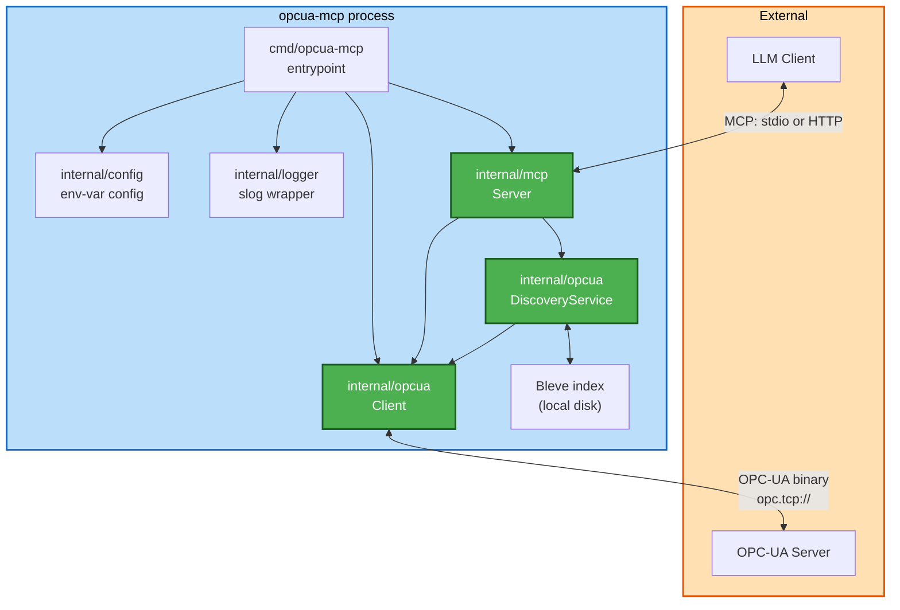
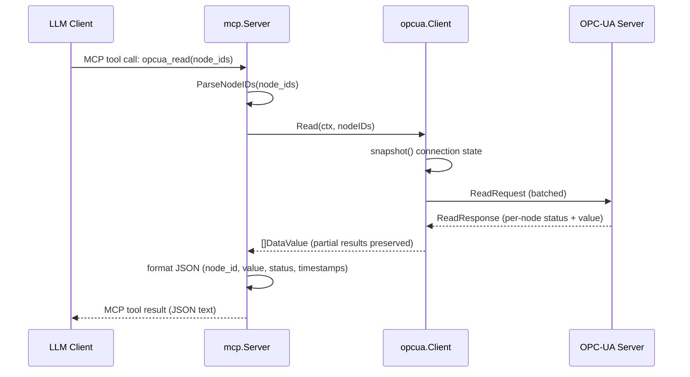

# System Architecture

## System Overview

A single Go module (`github.com/mwieczorkiewicz/opcua-mcp`, one binary,
`cmd/opcua-mcp`) with four internal packages. No microservices, no
infrastructure-as-code, no external datastore beyond an embedded Bleve
full-text index on local disk — this is a standalone server process, not a
distributed system. It speaks two protocols: MCP (to its LLM client, over
stdio or HTTP) and OPC-UA binary (to the industrial server it bridges to).

## Architecture Diagram



### Text alternative
```
cmd/opcua-mcp (entrypoint)
  -> internal/config     (load + validate env vars)
  -> internal/logger     (init structured logging)
  -> internal/opcua.Client       (construct; connect eagerly unless stdio)
  -> internal/mcp.Server         (construct; owns Client + DiscoveryService)
       -> SetupTools()/SetupResources() (register all MCP tools/resources)
       -> DiscoveryService.Start()      (background address-space walk)
       -> startStdio() or startHTTP()   (serve MCP over the configured transport)

internal/mcp.Server  --calls-->  internal/opcua.Client   --OPC-UA binary-->  OPC-UA Server
internal/mcp.Server  --calls-->  internal/opcua.DiscoveryService
internal/opcua.DiscoveryService --calls--> internal/opcua.Client (Browse)
internal/opcua.DiscoveryService <--> Bleve full-text index (local disk, ./search_index)
```

## Component Descriptions

### `cmd/opcua-mcp` (entrypoint)
- **Purpose**: Process startup — load config, init logger, construct and
  wire the `Client` and `Server`, connect eagerly unless stdio transport,
  start the server.
- **Responsibilities**: Startup sequencing only; no business logic.
- **Dependencies**: `internal/config`, `internal/logger`, `internal/mcp`,
  `internal/opcua`.
- **Type**: Application entrypoint.

### `internal/mcp` — `Server`
- **Purpose**: The MCP-facing layer. Registers all 15 tools and 2 resources,
  runs the transport loop, handles graceful shutdown.
- **Responsibilities**: Tool/resource registration (`SetupTools`,
  `SetupResources`), argument parsing and response formatting per tool
  handler, stdio/HTTP transport selection, graceful shutdown (stops
  discovery, drains the HTTP listener if running, disconnects the OPC-UA
  client).
- **Dependencies**: `internal/opcua` (`Client`, `DiscoveryService`),
  `internal/config`, `internal/logger`, `mark3labs/mcp-go`.
- **Type**: Application (protocol-facing service layer).

### `internal/opcua` — `Client`
- **Purpose**: Thin, connection-state-safe wrapper over `gopcua/opcua`'s
  low-level `*opcua.Client`.
- **Responsibilities**: Connect/disconnect lifecycle (mutex-guarded state),
  `Read`/`Write`/`Browse` (with `BrowseNext` pagination), per-attribute node
  reads, write-time type validation/conversion.
- **Dependencies**: `gopcua/opcua`, `internal/config`, `internal/logger`.
- **Type**: Client (wraps an external protocol library).

### `internal/opcua` — `DiscoveryService`
- **Purpose**: Background address-space crawler + searchable cache.
- **Responsibilities**: Periodic (ticker-driven) and on-demand
  (`opcua_force_discovery`) address-space walks with generation-tagged
  mark-and-sweep cache maintenance; tiered name-based search (exact,
  wildcard/contains, fuzzy) over both an in-memory cache and a persistent
  Bleve full-text index.
- **Dependencies**: `internal/opcua.Client` (for `Browse`), `blevesearch/bleve`,
  `internal/config`, `internal/logger`.
- **Type**: Application (background service + search engine integration).

### `internal/config`
- **Purpose**: Typed, validated configuration from environment variables.
- **Responsibilities**: Parsing (4 structs: `ServerConfig`, `OPCUAConfig`,
  `MCPConfig`, `SearchConfig`), validation of field combinations.
- **Dependencies**: `caarlos0/env/v11`.
- **Type**: Shared/model package.

### `internal/logger`
- **Purpose**: Structured logging that's safe for stdio transport.
- **Responsibilities**: `slog` handler construction (JSON/text), output
  destination resolution — forces stderr whenever transport is stdio,
  regardless of configured output, since stdout carries the MCP JSON-RPC
  stream there.
- **Dependencies**: Go standard library `log/slog` only.
- **Type**: Shared/utility package.

## Data Flow

Sequence for a representative business transaction, `opcua_read`:



### Text alternative
```
1. LLM Client calls MCP tool opcua_read with node_ids
2. mcp.Server parses node_ids (single/CSV/JSON-array formats)
3. mcp.Server calls opcua.Client.Read(ctx, nodeIDs)
4. opcua.Client snapshots its connection state (mutex-guarded), sends a
   batched ReadRequest to the OPC-UA server
5. OPC-UA server returns per-node results (status + value each)
6. opcua.Client returns all results as-is (no top-level error for a
   per-node bad status - only a transport-level failure errors out)
7. mcp.Server formats the results as JSON and returns them as the tool result
```

## Integration Points

- **External protocol**: OPC-UA binary protocol (`opc.tcp://`) via
  `gopcua/opcua` — the only external system this server talks to.
- **MCP transport**: stdio (default, JSON-RPC over stdin/stdout, connects to
  OPC-UA lazily) or streamable HTTP (`SERVER_TRANSPORT=http`, connects
  eagerly).
- **Local persistence**: a Bleve full-text index on local disk
  (`SEARCH_INDEX_PATH`, default `./search_index`) — the only "datastore",
  and it's embedded, not a separate service.
- **No CDK/Terraform/CloudFormation, no Lambda, no managed cloud services** —
  this is a plain containerizable Go binary (see Dockerfile), deployable
  anywhere that can run a container or a Go binary and reach an OPC-UA
  endpoint.
