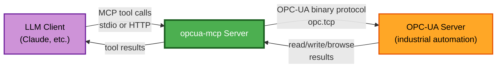

# Business Overview

## Business Context Diagram



### Text alternative
```
LLM Client --(MCP tool calls: stdio or HTTP)--> opcua-mcp Server
opcua-mcp Server --(OPC-UA binary protocol, opc.tcp://)--> OPC-UA Server
OPC-UA Server --(read/write/browse results)--> opcua-mcp Server
opcua-mcp Server --(tool results)--> LLM Client
```

## Business Description

- **Business Description**: `opcua-mcp` is a bridge that lets a Large Language
  Model (via the Model Context Protocol) read from, write to, and explore the
  address space of an OPC-UA industrial automation server - the standard
  protocol for PLCs, SCADA systems, and industrial sensors/actuators. It turns
  an LLM into an operator console for industrial equipment: an LLM-driven
  client can ask "what's the current boiler temperature" or "set setpoint X
  to 42" without the human writing OPC-UA client code themselves.

- **Business Transactions** (the system's core capabilities, each exposed as
  one or more MCP tools):
  1. **Read a value** - get the current value(s) of one or more OPC-UA
     variable nodes (`opcua_read`, `opcua_get_value`, `opcua_get_value_by_name`).
  2. **Write a value** - write a validated, type-converted value to a
     writable OPC-UA node (`opcua_write`).
  3. **Browse the address space** - walk the OPC-UA node hierarchy, either
     one level or recursively to a depth (`opcua_browse`, `opcua_browse_nodes`).
  4. **Discover and search nodes by name** - find a node by exact or
     fuzzy/partial browse name without knowing its node ID up front
     (`opcua_find_similar_nodes`, plus the discovery/search subsystem backing
     `opcua_get_value_by_name`).
  5. **Inspect node/server metadata** - get a node's class and type
     information, or the OPC-UA server's own status (`opcua_node_info`,
     `opcua_server_info`).
  6. **Manage the connection** - explicitly connect/disconnect from the
     OPC-UA server (`opcua_connect`, `opcua_disconnect`) - primarily relevant
     in stdio transport mode, which connects lazily.
  7. **Operate/diagnose the discovery cache** - inspect cache statistics,
     force an immediate re-discovery, or run diagnostics against the search
     index (`opcua_discovery_stats`, `opcua_force_discovery`,
     `opcua_debug_search`, `opcua_ensure_server_nodes`).

- **Business Dictionary**:
  - **Node**: an addressable item in an OPC-UA server's address space (a
    variable, object, method, etc.), identified by a **NodeID** (e.g.
    `i=85`, `ns=2;s=Temperature`).
  - **Browse Name**: a node's short, human-readable identifier within its
    namespace (distinct from its NodeID) - what a search-by-name tool
    matches against.
  - **Address Space**: the full hierarchical/graph structure of nodes an
    OPC-UA server exposes.
  - **NodeClass**: an OPC-UA node's category (Object, Variable, Method,
    ObjectType, VariableType, ReferenceType, DataType, View).
  - **Discovery**: this server's own background process of walking the
    live OPC-UA server's address space and caching what it finds, so
    name-based search/lookup tools don't need a live browse for every call.
  - **MCP (Model Context Protocol)**: the protocol this server speaks to
    its LLM client, over either stdio (process pipes) or streamable HTTP.

## Component Level Business Descriptions

### `internal/opcua` (OPC-UA client + discovery)
- **Purpose**: All direct interaction with the OPC-UA server - reading,
  writing, browsing, and background address-space discovery/search.
- **Responsibilities**: Connection lifecycle, type-safe read/write with
  data-type validation, paginated browsing, and maintaining a searchable
  cache of the server's address space.

### `internal/mcp` (MCP server)
- **Purpose**: Exposes the OPC-UA capabilities above as MCP tools/resources
  to an LLM client.
- **Responsibilities**: Tool registration and argument parsing, request
  routing to `internal/opcua`, response formatting, transport (stdio/HTTP)
  handling, graceful shutdown.

### `internal/config`
- **Purpose**: Turns environment variables into typed, validated
  configuration for every other component.
- **Responsibilities**: Env-var parsing (`caarlos0/env`), validation of
  required combinations (e.g. username+password for username auth).

### `internal/logger`
- **Purpose**: Structured application logging that never corrupts the MCP
  JSON-RPC wire protocol.
- **Responsibilities**: `slog`-based logging, output destination
  resolution (forces stderr in stdio transport mode regardless of
  configured output).
