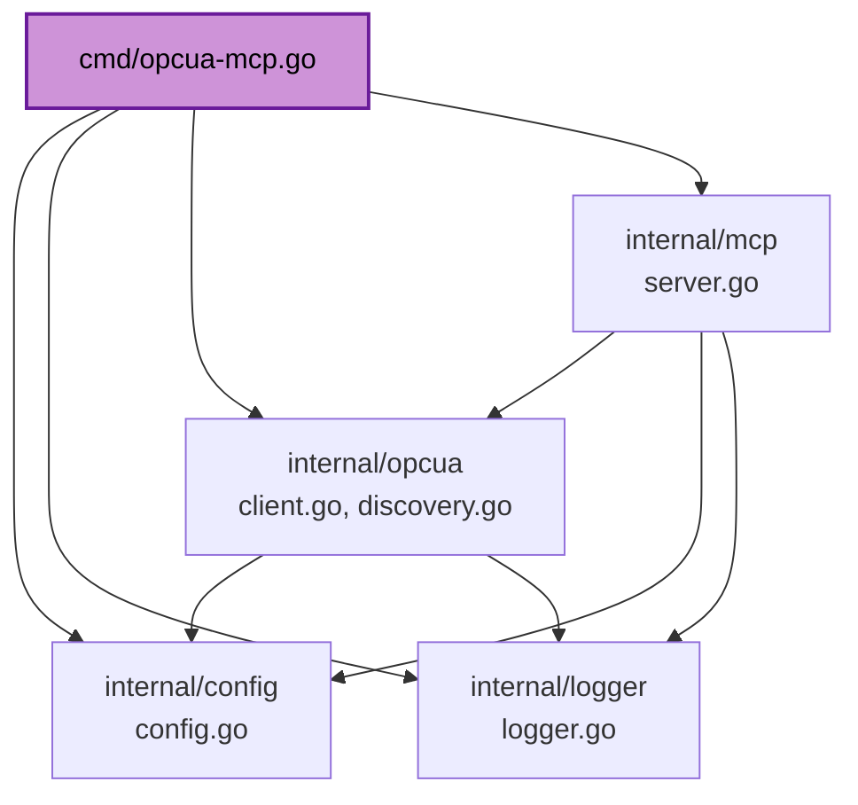

# Code Structure

## Build System
- **Type**: Go modules (`go build`/`go test`/`go vet`), wrapped by a `Makefile`
  (`make all` = `clean deps fmt lint test build`) and a multi-stage `Dockerfile`.
- **Configuration**: `go.mod` (module `github.com/mwieczorkiewicz/opcua-mcp`,
  `go 1.25.0`), `go.sum`, `Makefile`, `Dockerfile`, `.dockerignore` (absent —
  noted as a minor gap, not a functional issue since only the compiled binary
  reaches the final `scratch` image stage).

## Key Modules

### Existing Files Inventory

- `cmd/opcua-mcp.go` — process entrypoint; loads config, inits logger,
  constructs `Client`/`Server`, connects eagerly unless stdio, starts the
  server.
- `internal/mcp/server.go` — `Server` type; `SetupTools()`/`SetupResources()`
  register all 15 tools + 2 resources; one `handleX` method per tool;
  `startStdio()`/`startHTTP()`; `setupGracefulShutdown()`.
- `internal/mcp/server_test.go` — HTTP-shutdown mechanism test (real TCP
  listener, no live OPC-UA server needed) + tool-handler argument-validation
  and not-connected-error-branch tests.
- `internal/opcua/client.go` — `Client` type wrapping `gopcua/opcua`;
  `opcuaClient` interface (`Connect`/`Close`/`Read`/`Write`/`Browse`/
  `BrowseNext`) that `Client.client` is typed as, for test mocking; mutex
  (`mu`) + `snapshot()` helper guarding `client`/`connected`; per-attribute
  node reads; write-time type validation/conversion (`NodeTypeInfo`,
  `ValidateValueForNode`, `convertValueToOPCUAType` and friends).
- `internal/opcua/client_test.go` — table-driven tests for connection-state
  concurrency (`-race`), `Read`/`Write`/`Browse`/`BrowseNext` behavior
  (including the mock-driven partial-batch and continuation-point cases),
  `GetNodeClass` decoding, numeric string parsing, `ParseNodeIDs`.
- `internal/opcua/mock_client_test.go` — `mockOpcuaClient` (implements
  `opcuaClient`) plus `typeInfoReadFunc`/`singleAttrReadResponse` helpers for
  building canned multi-attribute read responses.
- `internal/opcua/discovery.go` — `DiscoveryService` type; ticker-driven +
  on-demand address-space walk (`discoverNodes`/`discoverNodeRecursive`)
  with generation-tagged mark-and-sweep (`walkGen`/`NodeInfo.SeenInGen`,
  `discoveryMu`); in-memory `nodeCache` (`cacheMutex`); Bleve-backed and
  cache-fallback tiered search (`searchExact`/`searchWildcard`/`searchFuzzy`
  vs. `*FromCache` variants); cache stats, hierarchy, debug-search helpers.
- `internal/opcua/discovery_test.go` — `treeBrowser` (adjacency-map mock
  address space built on the same `opcuaClient` seam) + sweep, shared-subtree,
  `MaxNodesPerBrowse`-accounting, concurrent-read, and Bleve-sweep tests.
- `internal/opcua/discovery_search_test.go` — cache-backed search-tier tests
  (real assertions) + a smoke test for the Bleve-backed tiers (see
  `code-quality-assessment.md` for the known gap those tests surfaced).
- `internal/config/config.go` — `Config`/`ServerConfig`/`OPCUAConfig`/
  `MCPConfig`/`SearchConfig` structs, `Load()`, `Validate()`.
- `internal/config/config_test.go` — table-driven config parsing/validation
  tests (highest coverage in the repo, 96.3%).
- `internal/logger/logger.go` — `Logger` (`slog` wrapper), `resolveLogOutput`
  (stdio-forces-stderr logic), global convenience functions.
- `internal/logger/logger_test.go` — table-driven `resolveLogOutput` tests.
- `Makefile`, `Dockerfile`, `README.md`, `CLAUDE.md`, `docs/COMMIT_CONVENTION.md`
  — build/docs/process, not application code.

## Design Patterns

### Mutex + snapshot (concurrency safety)
- **Location**: `internal/opcua/client.go` (`Client.mu`, `Client.snapshot()`),
  `internal/opcua/discovery.go` (`DiscoveryService.cacheMutex`,
  `DiscoveryService.discoveryMu`).
- **Purpose**: Every method that reads mutable shared state (connection
  handle/flag, node cache, walk generation) does so through a single
  lock-and-copy helper rather than touching fields directly, so the pattern
  is easy to audit (`grep` for direct field access should only match inside
  the helper/constructor/setter).
- **Implementation**: `Client.snapshot()` takes `mu.RLock()` and returns
  `(opcuaClient, bool)`; `Connect()` does its slow dial/retry against a local
  variable and only takes `mu.Lock()` briefly to publish the result, so
  concurrent reads never block for the retry duration.

### Interface-seam mocking (no live server needed for tests)
- **Location**: `internal/opcua/client.go` (`opcuaClient` interface),
  `internal/opcua/mock_client_test.go` (`mockOpcuaClient`).
- **Purpose**: `Client.client` is typed as a narrow interface covering only
  the gopcua methods this package calls (`Connect`/`Close`/`Read`/`Write`/
  `Browse`/`BrowseNext`), not the concrete `*opcua.Client` — so tests can
  inject a mock returning canned responses and counting calls, without a
  live or simulated OPC-UA server.
- **Reuse**: `internal/opcua/discovery_test.go`'s `treeBrowser` builds an
  in-memory address space on top of the same seam, exercising the real
  `Client.Browse` (including its `BrowseNext` loop) rather than mocking at
  the `DiscoveryService` level directly.

### Generation-tagged mark-and-sweep (cache correctness)
- **Location**: `internal/opcua/discovery.go`.
- **Purpose**: Keep a long-lived in-memory cache (and a persistent Bleve
  index) in sync with a live external system that can have nodes appear and
  disappear, without ever exposing readers to an empty-then-rebuilding cache
  and without leaking stale entries forever.
- **Implementation**: each walk increments `walkGen`; every node touched
  during the walk is upserted with `SeenInGen = walkGen`; after the walk, a
  single sweep pass removes anything whose `SeenInGen` fell behind, from
  both the map and the same Bleve batch that re-indexes survivors.
  `discoveryMu` ensures only one walk (ticker-driven or on-demand) runs at a
  time.

## Critical Dependencies

### `github.com/gopcua/opcua` v0.9.0
- **Usage**: `internal/opcua/client.go` — the actual OPC-UA wire protocol
  implementation this whole project bridges to.
- **Purpose**: Connect/session/secure-channel management, Read/Write/Browse/
  BrowseNext request-response, node/attribute type system (`ua` subpackage).

### `github.com/mark3labs/mcp-go` v0.39.1
- **Usage**: `internal/mcp/server.go` — the MCP protocol implementation
  (tool/resource registration, stdio and streamable-HTTP transports).
- **Purpose**: Everything MCP-protocol-shaped; this project's `Server` type
  is a thin domain layer on top of it.

### `github.com/blevesearch/bleve/v2` v2.5.3
- **Usage**: `internal/opcua/discovery.go` — full-text search index over
  discovered nodes' browse/display names.
- **Purpose**: Fuzzy/partial node-name search without holding the whole
  address space in a linearly-scanned structure. Note: currently indirectly
  pulls in `go.etcd.io/bbolt` (see `dependencies.md`).

### `github.com/caarlos0/env/v11` v11.4.1
- **Usage**: `internal/config/config.go` — struct-tag-driven env var parsing.
- **Purpose**: All configuration comes from environment variables; this is
  the only mechanism for that.
