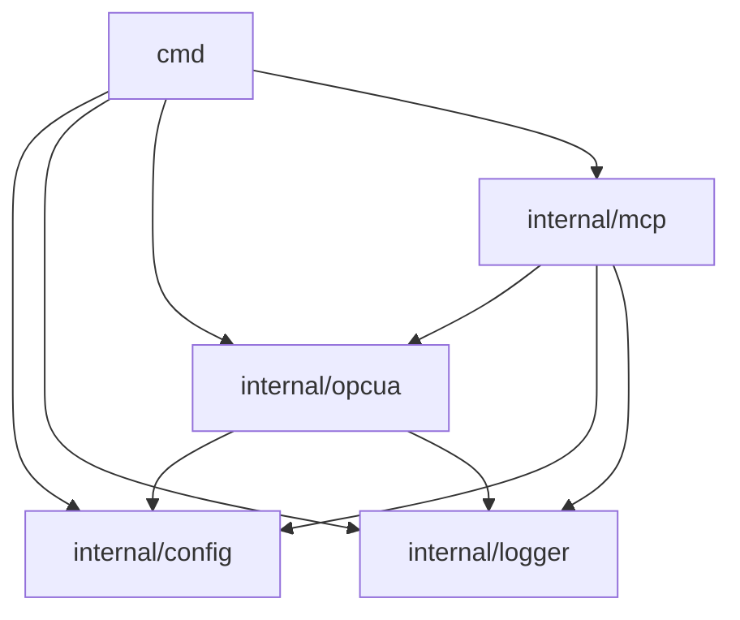

# Dependencies

## Internal Dependencies

### `cmd` depends on `internal/config`, `internal/logger`, `internal/opcua`, `internal/mcp`
- **Type**: Compile
- **Reason**: Entrypoint wires every other package together.

### `internal/mcp` depends on `internal/opcua`, `internal/config`, `internal/logger`
- **Type**: Compile
- **Reason**: `Server` holds a `*opcua.Client` and `*opcua.DiscoveryService`, reads `*config.Config`, and logs via `internal/logger`.

### `internal/opcua` depends on `internal/config`, `internal/logger`
- **Type**: Compile
- **Reason**: `Client`/`DiscoveryService` are constructed from `config.OPCUAConfig`/`config.SearchConfig` and log via `internal/logger`.

No cyclic internal dependencies; `internal/config` and `internal/logger` depend on nothing else in this module (leaf packages).

## External Dependencies

### `github.com/gopcua/opcua` v0.9.0
- **Purpose**: OPC-UA binary protocol client - the core capability this project bridges to MCP.
- **License**: MIT

### `github.com/mark3labs/mcp-go` v0.39.1
- **Purpose**: MCP protocol implementation (tools, resources, stdio/streamable-HTTP transports).
- **License**: MIT

### `github.com/blevesearch/bleve/v2` v2.5.3
- **Purpose**: Embedded full-text search index for node browse/display names.
- **License**: Apache-2.0
- **Note**: pulls in ~25 indirect `blevesearch/*` packages and `go.etcd.io/bbolt` (below) transitively.

### `github.com/caarlos0/env/v11` v11.4.1
- **Purpose**: Struct-tag-driven environment variable parsing for all configuration.
- **License**: MIT

### `go.etcd.io/bbolt` v1.4.0 (currently indirect, via bleve)
- **Purpose**: Bleve's on-disk storage engine today; not yet used directly by this project's own code. Planned to be promoted to a direct dependency for Phase 2's persistent value/subscription cache (pre-approved in `CLAUDE.md`'s hard rules).
- **License**: MIT

All other entries in `go.mod`'s indirect block are transitive dependencies of the four direct dependencies above (mostly bleve's own segment/storage backends and mcp-go's JSON-schema tooling) - not independently significant to this project's own architecture.
