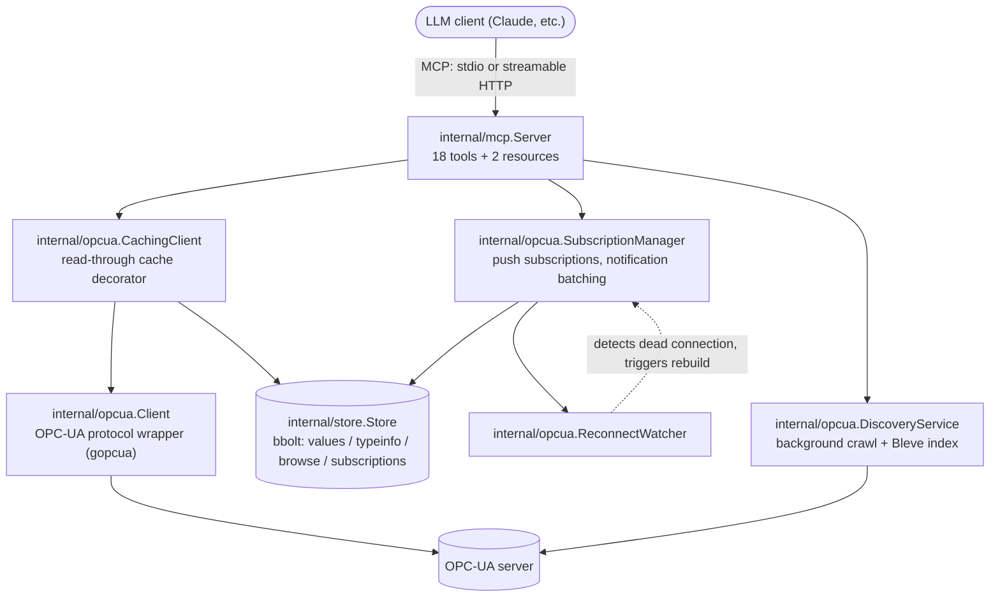

# Architecture

## Overview



```
cmd/opcua-mcp.go        entrypoint: load config, build client/services, start server
internal/
├── config/             env-var config structs (caarlos0/env)
├── logger/              slog wrapper; forces stderr in stdio mode
├── opcua/
│   ├── client.go        OPC-UA protocol wrapper (Read/Write/Browse/GetNodeTypeInfo/...)
│   ├── caching_client.go  read-through cache decorator over Client
│   ├── discovery.go     background crawl + Bleve full-text index
│   ├── subscription.go  SubscriptionManager
│   └── reconnect_watcher.go
├── store/               bbolt persistence (values/typeinfo/browse/subscriptions buckets)
└── mcp/
    └── server.go        MCP tool/resource registration and handlers
```

## `Client`: the protocol layer

`internal/opcua/client.go` wraps `gopcua/opcua` behind a package-internal
`opcuaClient` interface (`Connect`/`Close`/`Read`/`Write`/`Browse`/`BrowseNext`)
so tests can inject a mock (`mock_client_test.go`) instead of hitting a real
server. It has no cache and no subscription awareness — every call is live.

Notable behavior:
- `Read` returns one result per requested node, each with its own status;
  a single bad-status node never discards the rest of the batch.
- `Browse` follows `BrowseNext` continuation points automatically (bounded by
  context and a hard iteration cap), so nodes with >1000 references aren't
  silently truncated.
- `Write` fetches `GetNodeTypeInfo` once, validates the value against it, and
  returns an error — not just a log line — if validation fails.
- Connection state (`client`, `connected`) is guarded by `sync.RWMutex`; every
  method reads it through a `snapshot()` helper rather than touching the
  fields directly, since the background discovery worker and MCP tool
  handlers both touch it concurrently.

## `CachingClient`: read-through cache

`internal/opcua/caching_client.go` decorates `*Client` with a read-through
cache backed by the bbolt `Store`. `Client` itself stays a pure protocol
wrapper; all cache-or-live decisions live here.

- **Read**: subscribed nodes are always served from their live push-updated
  cache entry (`Source: "subscription"`). Unsubscribed nodes are served from
  cache only if an entry exists and is younger than the caller's
  `max_age_ms`; otherwise it's a live read, opportunistically cached
  afterward. Every result carries `Source` (`live`/`cache`/`subscription`)
  and `CachedAt`.
- **Write**: delegates to `Client.Write`, then deletes the node's cached
  value on success — unless it's currently subscribed, in which case the
  next subscription push will correct it naturally.
- **Browse / GetNodeTypeInfo**: cached with their own TTLs
  (`STORE_BROWSE_TTL`, `STORE_TYPEINFO_TTL`).
- `SEARCH_ENABLE_CACHE=false` bypasses all of the above — every call goes
  live, reproducing pre-cache behavior exactly.

## `SubscriptionManager`: push updates

`internal/opcua/subscription.go` manages OPC-UA subscriptions (create,
cancel, list) and persists *intent* — node IDs + interval, never
server-assigned ephemeral subscription IDs, which are meaningless after a
reconnect.

- Nodes requesting the same `interval_ms` share one underlying gopcua
  `Subscription` (`intervalGroup`), reference-counted; the group is only
  torn down once its last logical subscription unsubscribes.
- `Subscribe` succeeds partially: nodes the server rejects come back in
  `rejected` with a reason each, rather than failing the whole call.
- Incoming notifications are batched into the values bucket by a background
  `pump` goroutine, flushing every `STORE_BATCH_WINDOW` or after
  `STORE_BATCH_MAX_ITEMS`, whichever comes first.
- `ReconnectWatcher` detects a permanently dead connection, reconnects, and
  calls back into the manager to discard in-memory subscription state (it
  died with the old client) and restore everything from persisted intent —
  the same path used on cold startup (`warmStart`), which completes before
  `Start` returns so `opcua_list_subscriptions` is always consistent with
  persisted state, even immediately after a restart.

## `Store`: bbolt persistence

`internal/store/store.go` is a bbolt-backed key-value store with four
buckets — `values`, `typeinfo`, `browse`, `subscriptions` — and no TTL logic
of its own; it returns whatever was last written, verbatim, and leaves
freshness decisions to callers (`CachingClient`, `SubscriptionManager`).
Concurrency safety comes entirely from bbolt's single-writer/MVCC-reader
transaction model — no additional locking layered on top.

Values are stored with a tagged encoding (`value_encoding.go`) that
preserves the exact Go type across a JSON round-trip — plain
`encoding/json` unmarshaling into `interface{}` would collapse every number
to `float64`, silently changing e.g. an `int32` value's dynamic type on
read-back.

If the store fails to open (stale lock from a prior ungraceful shutdown,
read-only filesystem, ...), the server logs a warning and keeps running with
caching forced off and the subscription tools returning an error — every
other tool is unaffected.

## `DiscoveryService`: background crawl + search index

`internal/opcua/discovery.go` walks the address space from
`SEARCH_DISCOVERY_ROOT_NODE` on a ticker (`SEARCH_DISCOVERY_INTERVAL`),
maintaining an in-memory node cache and a persistent on-disk
[Bleve](https://github.com/blevesearch/bleve) full-text index.

- **Mark-and-sweep**: each walk is generation-tagged. Every node touched in
  the current walk gets `SeenInGen` set; a sweep pass after the walk deletes
  anything not touched from both the in-memory cache and the Bleve index in
  the same batch. The cache is upserted in place rather than
  wiped-then-rebuilt, so concurrent reads during a walk never see a
  spuriously empty cache, and nodes removed from the live server are
  actually removed from the index too.
- **Graph-safe traversal**: a walk-scoped `visited` set stops a subtree
  shared by multiple parents (address spaces are graphs, not trees) from
  being re-browsed once per incoming reference.
- **Concurrency**: `discoveryMu` serializes the ticker-driven walk against an
  explicit `opcua_force_discovery` call — only one walk runs at a time. It's
  held for the whole walk but never across a Bleve I/O call outside
  `updateSearchIndex`'s existing batch pattern.

**Known gap**: `GetNodeByBrowseName` and the tiered Bleve search methods
(`searchExact`/`searchWildcard`/`searchFuzzy`, `SearchNodes`,
`SearchByDepth`, `SearchByNodeClass`) return zero hits for some queries that
should match. `browse_name` is mapped with both a text and a keyword
analyzer on the same field path in `NewDiscoveryService` — confirmed root
cause for that field. A couple of other query paths (numeric depth range,
node_class exact term) also come back empty without a confirmed root cause
yet. Don't rely on these search tiers for new behavior until this is
investigated.

## Concurrency rules

- `Client.client`/`Client.connected`: guard with `Client.mu`, always via
  `snapshot()`.
- Never call `store`/Bleve methods while holding `DiscoveryService.cacheMutex`
  or `SubscriptionManager.mu` — snapshot needed data under the lock, release,
  then do I/O.
